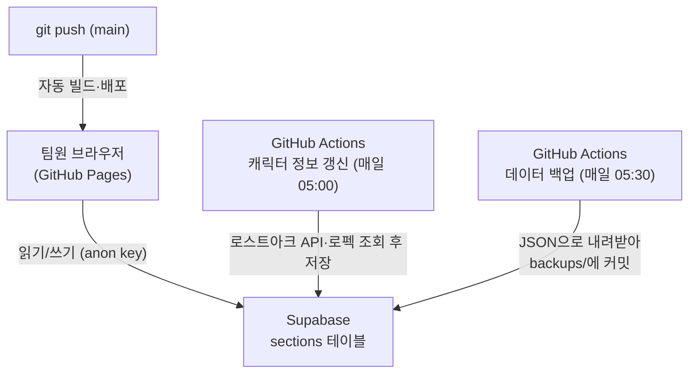

# VALOA 레이드 시트

구글 시트로 관리하던 로스트아크 고정 공대 레이드표를 웹앱으로 옮긴 프로젝트입니다.
캐릭터 로스터, 레이드 참여 체크, 팟 편성 보드, 골드표를 한 화면에서 관리하고,
캐릭터 전투력·아이템 레벨은 로스트아크 공식 API로, 로펙 점수·젬 효율은 로펙 캐릭터 페이지 기준으로 매일 자동 갱신됩니다.

## 전체 구조



- 화면은 GitHub Pages에서 정적 파일로 서비스됩니다. 서버를 따로 운영하지 않습니다.
- 데이터는 Supabase 무료 티어의 `sections` 테이블 한 곳에 섹션별 JSON으로 저장됩니다.
- 로그인은 없습니다. 주소를 아는 사람은 누구나 수정할 수 있으므로 링크는 팀 안에서만 공유해 주세요.
- 실수로 덮어써도 각 탭의 "되돌리기" 버튼과 일일 백업으로 복구할 수 있습니다.

## 처음 한 번만 하는 설정

### 1. Supabase 프로젝트 만들기

1. [supabase.com](https://supabase.com)에서 무료 프로젝트를 만듭니다.
2. 대시보드의 SQL Editor에 `supabase/schema.sql` 내용을 붙여 넣고 실행합니다.
3. Project Settings → API에서 세 가지 값을 확인해 둡니다.
   - Project URL
   - `anon` `public` 키 (브라우저용)
   - `service_role` 키 (자동 갱신 스크립트용 — 외부에 노출하면 안 됩니다)

### 2. GitHub 저장소 설정

1. 이 폴더를 GitHub 저장소로 올립니다.
2. Settings → Pages → Source를 **GitHub Actions**로 바꿉니다.
3. Settings → Secrets and variables → Actions에 다음 값을 넣습니다.

| 종류 | 이름 | 값 |
| --- | --- | --- |
| Variable | `VITE_SUPABASE_URL` | Supabase Project URL |
| Variable | `VITE_SUPABASE_ANON_KEY` | anon public 키 |
| Variable | `VITE_REFRESH_WORKFLOW_URL` | 선택값. 캐릭터 탭에서 열 GitHub Actions 수동 갱신 페이지 URL |
| Secret | `SUPABASE_URL` | Supabase Project URL (위와 같은 값) |
| Secret | `SUPABASE_SERVICE_ROLE_KEY` | service_role 키 |
| Secret | `LOSTARK_API_KEY` | [로스트아크 개발자 포털](https://developer-lostark.game.onstove.com)에서 발급한 API 키 |

`VITE_REFRESH_WORKFLOW_URL`은 없어도 앱은 동작합니다. 넣어 두면 캐릭터 탭에서 Actions 수동 갱신 화면으로 바로 이동할 수 있습니다.
값은 보통 `https://github.com/<owner>/<repo>/actions/workflows/refresh.yml` 형태입니다.

4. main 브랜치에 push하면 자동으로 빌드·배포됩니다.
   배포 주소는 Actions의 "Pages 배포" 실행 결과에서 확인할 수 있습니다.

5. 배포된 주소를 처음 열면 시트에서 옮겨 온 초기 데이터(캐릭터 41개, 레이드 9종)가
   Supabase에 자동으로 올라갑니다. 이후부터는 DB 값이 기준입니다.

## 화면 사용법

| 탭 | 하는 일 |
| --- | --- |
| 편성 보드 | 레이드를 고르고 팟을 추가한 뒤, 후보 캐릭터를 눌러 선택하고 슬롯을 눌러 배치합니다. PC에서는 드래그로도 넣을 수 있습니다. 같은 사람의 캐릭터가 한 팟에 겹치면 "❌ 사람 중복"이 바로 표시되고, 팟별 평균 전투력도 자동 계산됩니다. |
| 레이드 체크 | 캐릭터별로 이번 주에 갈 레이드를 체크합니다. 체크된 캐릭터만 편성 보드의 후보 목록에 나타납니다. |
| 캐릭터 | 전체 로스터와 전투력·아이템 레벨, 로펙 점수, 젬 효율을 봅니다. 캐릭터별 `로펙` 버튼은 해당 캐릭터의 로펙 페이지를 새 탭으로 엽니다. 값은 매일 새벽 자동 갱신됩니다. |
| 골드표 | 레벨 구간별·레이드별 골드 시세를 봅니다. 시세가 바뀌면 `src/seed.ts`를 수정해 주세요. |

팟 인원수는 레이드마다 다를 수 있어 보드 상단에서 4인/8인/16인을 고를 수 있습니다.
초기값은 시트 기준으로 넣었으니 실제 레이드 인원과 다르면 바꿔 주세요.

편성을 실수로 지웠거나 다른 팀원과 편집이 겹쳤다면, 해당 탭에서 "↩ 되돌리기"를 누르면
마지막 저장 직전 상태로 돌아갑니다. 연달아 누르면 그만큼 더 이전으로 돌아갑니다.

## 로컬에서 개발하기

```bash
npm install
npm run dev
```

Supabase 환경변수 없이 실행하면 "로컬 모드"로 뜨고 브라우저 localStorage에만 저장됩니다.
공유 모드로 테스트하려면 `.env.local`에 `VITE_SUPABASE_URL`, `VITE_SUPABASE_ANON_KEY`를 넣고 실행합니다.

캐릭터 갱신 스크립트를 로컬에서 돌려 보려면 `.env`에 값을 채운 뒤 실행합니다.

```bash
pip install -r scripts/requirements.txt
python scripts/update_characters.py   # 전투력/아이템 레벨, 로펙 점수/젬 효율 갱신
python scripts/backup.py              # backups/날짜.json 생성
```

## 자동화 동작 시점

| 워크플로 | 시점 | 하는 일 |
| --- | --- | --- |
| Pages 배포 | main push 시 | 빌드 후 GitHub Pages 배포 |
| 캐릭터 정보 갱신 | 매일 KST 05:00 | 로스트아크 API로 전투력·아이템 레벨을 갱신하고, 로펙 페이지에서 현재 점수·최고 점수·젬 효율을 읽어 저장 |
| 데이터 백업 | 매일 KST 05:30 | 현재 편성·체크 데이터를 `backups/`에 JSON으로 커밋 (되돌리기 이력은 제외) |

갱신이 안 도는 것 같으면 Actions 탭에서 `캐릭터 정보 갱신` 워크플로를 수동 실행해 보세요.
공식 API 실패 로그에 캐릭터 이름이 찍혀 있으면 개명·삭제된 캐릭터일 수 있으니 캐릭터 탭 데이터를 정리해 주세요.
로펙은 공개 API가 아니라 캐릭터 페이지 HTML을 읽기 때문에, 요청 제한이나 페이지 구조 변경이 있으면 해당 값만 비어 있을 수 있습니다.

## 데이터 복구

- 방금 한 실수: 해당 탭의 "↩ 되돌리기" 버튼을 사용합니다.
- 크게 망가진 경우: `backups/`에서 원하는 날짜의 JSON을 열어, Supabase SQL Editor에서
  `sections` 테이블의 해당 `key` 행 `data`를 그 값으로 업데이트하면 됩니다.

## 시트에서 아직 안 옮긴 것

- 자동 편성(시트 v1.4.0 기능): 지금은 수동 편성 + 검증까지만 구현되어 있습니다.
- 금주의 가디언 표시, 주간(수요일) 초기화 자동화.

필요해지면 이슈로 남겨 두고 하나씩 추가하면 됩니다.
